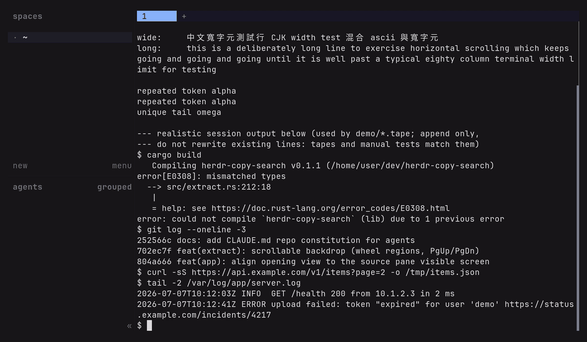
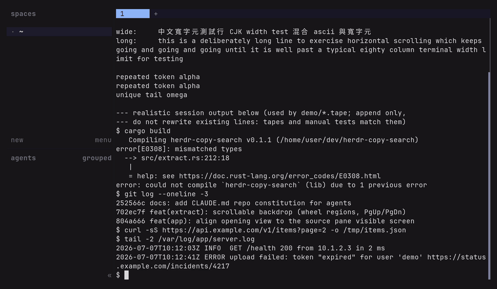

# herdr-copy-search

Incremental regex search over [herdr](https://herdr.dev) pane
scrollback, tmux-copycat-style predefined pattern search, and
extrakto-style token extraction, with a tmux-style copy mode for
refining and yanking matches. All copying goes through OSC 52, so it
works over SSH without any clipboard helper on the remote host.

<!-- github.com will not play a repo-relative <video> src inline, so the
README embeds committed GIFs derived from the mp4s (regenerate with
`just gifs`; see docs/checklists/CL-04). The crisp mp4s play inline on the
docs site linked below. -->


Since v0.7.4 herdr's native copy mode has literal smart-case search
built in - use it for plain browsing and literal lookups (it reads
the full scrollback). This plugin covers what native does not: regex
+ smartcase incremental search that drops you into a copy mode at the
match, predefined and user-defined patterns, token extraction, and
soft-wrap-aware matching. The coexistence positioning and the exit
conditions live in [docs/ROADMAP.md](docs/ROADMAP.md).

Docs site (with the demos playing inline, which github.com will not do):
<https://qq88976321.github.io/herdr-copy-search/>.

## Status

Personal tool, built with heavy AI assistance (Claude Code). I review
what ships and use it daily over SSH, but it comes with no warranty
and no support commitment: issues and PRs are welcome and may still
go unanswered. Expect tmux-like behavior, not tmux-grade maturity.

## Install

```sh
herdr plugin install qq88976321/herdr-copy-search   # from a git host
# or for local development:
herdr plugin link /path/to/herdr-copy-search
cargo build --release --locked                   # link does not run build steps
```

There is no separate plugin update in v1; reinstall from the git host
to refresh a managed plugin.

Bind keys in `~/.config/herdr/config.toml` (reload with
`herdr server reload-config`):

```toml
[[keys.command]]
key = "prefix+["
type = "shell"
command = "herdr plugin pane open --plugin copy-search --entrypoint copy"

[[keys.command]]
key = "prefix+/"
type = "shell"
command = "herdr plugin pane open --plugin copy-search --entrypoint search"

[[keys.command]]
key = "prefix+tab"
type = "shell"
command = "herdr plugin pane open --plugin copy-search --entrypoint extract"
```

If your herdr build supports `type = "plugin_action"` bindings, the
plugin also exposes `copy-search.copy`, `copy-search.search`, and
`copy-search.extract` actions that open the same panes.

## Recommended herdr settings

This plugin opens as a herdr overlay pane; herdr draws a border around
it and renders it full-window. To make it feel more in-place, set

```toml
[ui]
pane_borders = false
```

in `~/.config/herdr/config.toml` (then `herdr server reload-config`) to
drop the frame herdr draws around the overlay. It is a global setting
that also removes split-pane dividers, so it suits one-pane-per-tab
layouts best. herdr v0.7.x has no pane-scoped floating surface yet, so
the overlay always covers the whole window (`--placement overlay` and
`zoomed` render the same); confining it to a single pane awaits upstream
floating surfaces.

## Search / copy mode

Opens an overlay over the focused pane showing its recent scrollback
(the herdr server caps pane reads at about 1000 lines). The `search`
entrypoint opens with the search prompt active; committing a search
lands in copy mode on the match - no scrolling - to refine the
selection and yank. The `copy` entrypoint is the same view opened
idle.

| Keys | Action |
| --- | --- |
| `h j k l`, arrows | move (a column count is kept across short lines) |
| `w b e`, `{ }` | word and paragraph motions |
| `0 ^ $`, `g G` | line start/end, buffer top/bottom |
| `ctrl+f/b/d/u`, PgUp/PgDn | page and half-page |
| `/` `?` | incremental regex search down / up (invalid regex falls back to literal) |
| in prompt: `Left/Right`, `Home/End`, `Delete` | edit the query, readline-style: `ctrl+a/e` line ends, `ctrl+b/f` char, `ctrl+left/right` word, `ctrl+w` delete word, `ctrl+k` kill to end, `ctrl+d` delete, `ctrl+u` clears |
| `n` `N` | next / previous match in search direction |
| `S` | toggle smartcase (default on: an all-lowercase query ignores case, any uppercase is case-sensitive; off is always case-sensitive) |
| `v` `V` | charwise / linewise selection |
| `iw aw iW aW` | select the word / WORD text object under the cursor (works after `v` or on its own) |
| `y` | copy selection, or the match under the cursor |
| `Enter` | copy the selection or the match under the cursor and exit; with nothing to copy, just exit |
| `p` | pattern menu: `[u]rl [f]ile [g]it-sha [i]p [d]igits [q]uoted` |
| `alt+u/f/g/i/d/q` | activate a pattern directly |
| mouse | wheel scrolls; click moves; drag selects and copies on release; double-click selects the WORD under the pointer, triple-click the whole (soft-wrap joined) line - both copy on release. A mouse copy keeps the selection highlighted (`Esc` clears it) |
| `q`, `Esc`, `ctrl+c` | exit (Esc clears the selection or cancels the search first; ctrl+c exits from any mode) |

Pattern searches run backward from the cursor like tmux-copycat: the
nearest match above is selected and `n` walks up through older output.

Add your own patterns, or disable defaults, in the plugin config file
(path from `herdr plugin config-dir copy-search`). A `pattern_<key>`
entry appears in the menu and on `alt+<key>`; an empty value removes a
default; reusing a default's key replaces its regex:

```toml
# $HERDR_PLUGIN_CONFIG_DIR/config.toml
pattern_t = "\\bTODO\\b"   # p then t, or alt+t
pattern_j = "\\{[^}]*\\}"  # a JSON-ish object
pattern_u = ""             # disable the built-in url pattern
```

Values are taken verbatim between the quotes (no TOML escape
processing). An invalid regex falls back to a literal search, matching
the incremental-search behavior.

### Colors

The mode badge and highlight colors can be themed in the same config
file. Each element takes an optional `_fg` and `_bg`; omit one to keep
its default. A value is a color name (`cyan`, `dark_yellow`, ...), a
0-255 palette index, or `#rrggbb` hex:

```toml
# $HERDR_PLUGIN_CONFIG_DIR/config.toml
badge_copy_bg    = "cyan"        # [copy] badge accent
badge_search_bg  = "magenta"     # [search] badge accent
match_bg         = "dark_yellow"
match_current_bg = "yellow"
cursor_bg        = "cyan"
indicator_bg     = "yellow"      # top-right position indicator
```

Colors honor `NO_COLOR`: the badge and indicator fall back to reverse
video.

## Extract mode

extrakto-style picker over the same scrollback: tokens (or whole lines)
are listed newest first and filtered with a built-in fuzzy matcher.
Like `fzf --height`, the picker occupies only the bottom of the overlay
(default 40%); the pane content stays visible above it in its original
colors.



Popup height: pass `--height PCT` in the pane command, or set it in
the plugin config file (path from `herdr plugin config-dir copy-search`):

```toml
# $HERDR_PLUGIN_CONFIG_DIR/config.toml
extract_height = 40
```

| Keys | Action |
| --- | --- |
| type / Backspace | edit the fuzzy query |
| `Left/Right`, `Home/End`, `Delete` | edit the query, readline-style: `ctrl+a/e` line ends, `ctrl+b/f` char, `ctrl+left/right` word, `ctrl+w` delete word, `ctrl+k` kill to end, `ctrl+d` delete |
| `Up`/`Down`, `ctrl+p/n` | move the selection |
| `PgUp/PgDn`, wheel over the backdrop | scroll the pane output above the popup (wheel over the list moves the selection) |
| `Enter` | insert the pick into the source pane (`herdr pane send-text`) |
| `Tab` | copy the pick via OSC 52 |
| `ctrl+t` | toggle word / line granularity |
| `ctrl+u` | clear the query |
| `Esc` | clear the query, then exit |
| `ctrl+c` | exit |

Top to bottom the picker reads: the candidate list, a dim keybind
hint, a separator rule, then the input row; a divider rule separates
the pane backdrop above from the candidates. The `[word]`/`[line]`
badge and the selected row are themable in the same config file
(`_fg`/`_bg`, same value syntax as the copy-mode colors):

```toml
# $HERDR_PLUGIN_CONFIG_DIR/config.toml
badge_word_bg       = "blue"
badge_line_bg       = "green"
extract_selected_bg = "white"
```

## Development

```sh
just gate                                # fmt + clippy + test + release build
just run copy                            # fixture run outside herdr
herdr plugin pane open --plugin copy-search --entrypoint copy   # inside herdr
just release patch                       # bump + sync manifests + local tag
```

`--pane ID` overrides the source pane, `--lines N` the read size.
Outside herdr you can also pipe text on stdin; key events then come
from `/dev/tty`. Releases are local-only (`cargo-release` with
`publish = false`, `push = false`); `herdr-plugin.toml` is version-
synced automatically.

Where things are headed and how work gets done here:
[docs/ROADMAP.md](docs/ROADMAP.md) (evidence-based roadmap, archive
conditions) and [docs/checklists/](docs/checklists/) (step-by-step
procedures: publishing, CI, releases, demo recording, feature loop,
upstream watch). The demos are scripted in [demo/](demo/) as vhs tapes
rendered to mp4, with `just gifs` deriving the README's inline GIFs, so
both regenerate after any UI change.

## Design notes

- Copying emits OSC 52 to `/dev/tty` and the process sleeps 200 ms
  before exiting so herdr can forward the write to the outer terminal.
  Payloads beyond ~100 KB of base64 may be truncated by the terminal;
  the status line warns when that can happen.
- The source pane is resolved from `--pane`, then
  `HERDR_ACTIVE_PANE_ID`, then the `focused_pane_id` field of
  `HERDR_PLUGIN_CONTEXT_JSON`. `HERDR_PANE_ID` is the overlay pane
  itself and is deliberately ignored.
- Nested launches are blocked: each live overlay writes a PID marker
  (named after its `HERDR_PANE_ID`) under
  `${XDG_RUNTIME_DIR:-<tmp>}/herdr-copy-search/panes`. If a new
  instance's source pane is a live overlay, the launch is nested and
  exits silently before drawing. The marker is removed on exit; one
  left by a dead process is reaped on the next check.
- Colors: buffer rows come from `pane read --source recent --format
  ansi` (styled, wrapped at the pane width) so the overlay looks like
  the frozen pane; a second `recent-unwrapped --format text` read
  aligns them into soft-wrap flags so yanks rejoin wrapped long lines.
  (`recent-unwrapped --format ansi` returns empty on herdr 0.7.1 once
  scrollback grows, hence the two-read composition.) The soft-wrap
  flags make navigation, word selection (iw/aw), search, and copy
  treat a word wrapped across two display rows as one unit; a word or
  URL split at the wrap is one motion target, one text object, and one
  search match/yank. Known limits: the wrapped word is still shown
  broken at the source pane's width (the overlay does not rewrap to its
  own width; tracked as ROADMAP F10), and if the pane changes between
  the two reads the wrap joining degrades to hard breaks for that
  snapshot.
- The bottom row is a persistent mode row (`[copy]` / `[search]`)
  holding the prompt, pattern menu, and messages, like herdr's native
  copy mode; match counts and the cursor position stay in the
  tmux-style top-right indicator. The badge is accent-colored (copy vs
  search; themable, see Colors) and, when the row is otherwise idle, it shows a dim,
  context-aware keybinding hint. Colors honor `NO_COLOR`, falling back
  to reverse/dim attributes that follow the terminal's own theme.
- Opening the overlay keeps the source pane's screen in place: a third
  `visible` read anchors the bottom-most view to the rows the pane was
  showing, so a partly filled screen stays at the top with blank rows
  below and scrolling back down restores the original screen. When the
  pane changes between reads, the anchor degrades to tail alignment.
- No serde or toml crates: herdr's context JSON and the plugin config
  are flat, so small string-field extractors are enough.
- Extract mode follows extrakto's convention (Enter inserts, Tab
  copies); copy mode follows tmux (Enter copies and exits).
